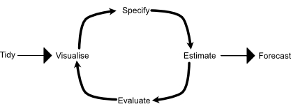

Welcome to this full write-up forecasting example using the nycflights13 data set. The solutions here will follow the chapters in Forecasting Principles and Practice, 3rd edition, by Rob J. Hyndman, and George Athanasopoulos.

The chapters are:

[1. Creating time series objects, plotting and autocorrelation](#objects)<br>
[2. Time Series Decomposition](#decomposition)<br>
[3. Time Series Features](#features)<br>
[4. The foreaster's basic toolbox](#toolbox).<br>
5. Time series regression models<br>
6. Exponential smoothing models<br>
7. ARIMA models<br>
8. Dynamic regression models<br>
9. Forecasting hierarchical and grouped time series<br>
10. Advanced forecasting methods<br>
---

# <a  id = "objects">1. Creating time series objects, plotting and autocorrelation</a>

We will begin by importing the required libraries into r.

```{r Import the data}
library(nycflights13)
library(tidyverse)
library(fpp3)
library(clock)

```

Our first step will be converting the nycflights13 data set into a tsibble, so time series forcasting can be done with the data. This will include setting up a date column to make the analysis much easier and faster

```{r Import the data, convert to a tsibble}

flights <- nycflights13::flights %>% 
    mutate(date = date_build(year = year, month = month, day = day))

flight1 <- flights %>% 
  mutate(date = date_build(year = year, month = month, day = day))

flight1 <- flight1 %>% 
  select(date, dep_time:distance)

```

# Clean up the data

The data has a few missing points, so it needs to be cleaned up before we can do full analysis with it. Specifically, it appears there are 8,255 rows with missing departure time, departure delay, arrival time, arrival delay and air time. The most likely explanation is that these flights were scheduled, but did not fly. Let's remove these rows from our data set.

```{r remove rows with flights listed but did not fly}
# 8,255 rows with missing departure times
flight1 %>%  filter(is.na(dep_time))

# remove rows with missing departure times
flight1 <- flight1 %>% 
  filter(!is.na(dep_time))

```

There are still 2,808 NAs in the data set. It appears all these flights did fly. Let's find these flights and see what we can do to clean everything up:

```{r Find the 2,808 rows with missing data but did fly}

sum(is.na(flight1)) # 2808

# Let's see where the NAs are located:
flight1 %>% 
  filter(!complete.cases(.))

# Just three columns contain all 2,808 NAs, so we'll build special data sets when we are making models to predict those values, otherwise we'll use the full data set when we create models to predict the values where we do have full data (such as predicting departure time):
sum(is.na(flight1$arr_time), is.na(flight1$arr_delay), is.na(flight1$air_time)) # 2,808

```

Just remember, when building models that include arrival time, arrival delay, and air time, to remove the rows with NAs first.

# Aggregate the data and create summary variables. The mean flight number column is used to create a key for the tsibble (next step)

```{r Aggregate the data}
flight1 <- flight1 %>% 
  group_by(date) %>% 
  summarise(
    flights = n(),
    mean_dep_time = mean(dep_time),
    mean_dep_delay = mean(dep_delay),
    mean_arrival_time = mean(arr_time, na.rm = TRUE),
    mean_arrival_delay = mean(arr_delay, na.rm = TRUE),
    mean_air_time = mean(air_time, na.rm = TRUE),
    mean_distance = mean(distance),
    key = 100
  ) %>% 
  ungroup()

```

# Calculate the most common carrier, destination and origin, and add those to the data set

```{r}
# Determine most common destination per day
mcd <- flights %>% 
  select(date, dest) %>% 
  group_by(date, dest) %>% 
  summarise(most_common_destination = n()) %>% 
  arrange(desc(most_common_destination)) %>% 
  filter(row_number() == 1) %>% 
  arrange(date)

flight1 <- flight1 %>% 
  mutate(most_common_destination = mcd$dest)

# Determine most common carrier per day
mcc <- flights %>% 
  select(date, carrier) %>% 
  group_by(date, carrier) %>% 
  summarise(most_common_carrier = n()) %>% 
  arrange(desc(most_common_carrier)) %>% 
  filter(row_number() == 1) %>% 
  arrange(date)

flight1 <- flight1 %>% 
  mutate(most_common_carrier = mcc$carrier)

# Determine most common origin per day
mco <- flights %>% 
  select(date, origin) %>% 
  group_by(date, origin) %>% 
  summarise(most_common_origin = n()) %>% 
  arrange(desc(most_common_origin)) %>% 
  filter(row_number() == 1) %>% 
  arrange(date)

flight1 <- flight1 %>% 
  mutate(most_common_origin = origin)


```


# Create a tsibble, from which we can do forecasting

```{r Convert flight1 into a tsibble}

flight1 <- flight1 %>% 
  as_tsibble(index = date, key = key) %>% 
  arrange(date) %>% 
  ungroup()

```

# Create a plot of the number of flights per day:

```{r plot of number of flights per day}
flight1 %>% 
  autoplot(flights)
```

# Create a plot for the mean departure time:

```{r plot mean departure time}

flight1 %>%
  autoplot(mean_dep_time)
```

# Superimpose mean departure time and mean departure delay:

```{r Combine mean departure time and mean departure delay}

flight1 %>% 
  autoplot(mean_dep_time) +
  geom_line(aes(y = mean_dep_delay))

```

# Exploring relationships <i>between</i> variables in our time series

```{r Seasonal plots of flights}

flight1 %>% 
 ggplot(aes(x = mean_dep_time, y = mean_dep_delay)) +
  geom_point() +
  labs(x = "Average departure time",
       y = "Average departure delay")

```

# Printing correlation between variables in our time series

```{r Pairs of correlations between all values in flight1}
flight1 %>% 
  GGally::ggpairs()
```

Discussion: Most correlations are <0.2, but a few are much larger:

The correlation between mean_distance and date = 0.473. This implies the later in the year a person flies, the farther they will travel.

The largest correlation is between mean of arrival delay, and mean of departure delay. That value is 0.944. There is a 94% probability in this data set that if a plane leaves late, it will arrive late.

# Lag plots

```{r Lagged scatterplots of flights}

flight1 %>% 
  gg_lag(flights, geom = "point") +
  labs(x = "lag(flights, k)")

```

(from the text) Each graph shows $y_t$ plotted against $y_{t-k}$ for different values of $k$

# Autocorrelation

(from the text) Just as correlation measures the extent of a linear relationship between two variables, autocorrelation measures the linear relationship between lagged values of a time series.

There are several autocorrelation coefficients, corresponding to each panel in the lag plot. For example, $r_1$ measures the relationship between $y_t$ and  $y_{t-1}$, $r_2$ measures the relationship between $y_t$ and $y_{t-2}$, and so on.

```{r Autocorrelation values for Flight 1 data set}
flight1 %>% ACF(flights, lag_max = 10)
```

We can view the values in the autocorrelation function:

```{r}
flight1 %>% 
  ACF(flights) %>% 
  autoplot() +
  labs(title = "Flights out of New York City in 2013, by day")
```

The strongest lags are at 7. 14, and 21 days. This is clearly due to the weekly nature of the business. $r_1$ is strong because the number of flights on any given day is strongly related to the number of flights the previous day.

(from the text) The dashed blue lines indicate whether the correlations are significantly different from zero.

# Trend and seasonality in our plot:

(from the text) When data have a trend, the autocorrelations for small lags tend to be large and positive because observations nearby in time are also nearby in value. So the ACF of a trended time series tends to have positive values that slowly decrease as the lags increase.

When data are seasonal, the autocorrelations will be larger for the seasonal lags (at multiples of the seasonal period) than for other lags.

If the values of $r_1$ through $r_t$ are all within the dotted blue lines, the results show white noise.

# <a  id = "decomposition">2. Time Series Decomposition</a>

## Time series components

(from the text) If we assume an aditive decomposition, then we can write:

<h3><center>$y_t = S_t + T_t + R_t$<br></center></h3>

where $y_t$ is the data, $S_t$ is the seasonal component, $T_t$ is the trend-cycle component, and $R_t$ is the remainder component, all at period t. Alternatively, a multiplicative decomposition would be written as:

<h3><center>$y_t = S_t \times T_t \times R_t$<br></center></h3>

## Example: Decomposition of flight1

This will allow us to look at the decomposition of flights in the flight1 data set:

```{r decomposition of flight1}

dcmp1 <- flight1 %>% 
  model(stl = STL(flights))
components(dcmp1)
```

Note that we can do the same for any other variable in our data set, such as mean arrival time:

```{r Decompisition of mean arrival time in flight1 data set}

dcmp2 <- flight1 %>% 
  model(stl = STL(mean_arrival_time))
components(dcmp2)

```

# Plot the data and the trend of the data for number of flights per day

```{r plot the data and the trend of the data}

components(dcmp1) %>% 
  as_tsibble() %>% 
  autoplot(flights, colour = "gray") + 
  geom_line(aes(y = trend), colour = "#D55E00") +
  labs(
    y = "flights",
    title = "Number and trend of flights per day"
  )
```

# Show all the components in a single file:

```{r show all components of a decomposition in a single file}

components(dcmp1) %>% autoplot()
```

# Seasonally adjusted data

From the text: If the seasonal component is removed from the original data, the resulting values are the “seasonally adjusted” data. For an additive decomposition, the seasonally adjusted data are given by $y_t - S_t$, and for multiplicative data the seasonally adjusted values are obtained by $\frac{y_t}{S_t}$

```{r Show seasonally adjusted data}

components(dcmp1) %>% 
  as_tsibble() %>% 
  autoplot(flights, colour = "gray") +
  geom_line(aes(y = season_adjust), colour = "#0072B2") +
  labs(
    y = "Flights",
    title = "Number and seasonally adjusted number of flights per day"
  )

```

# Moving averages

(from the text) The classical method of time series decomposition originated in the 1920s and was widely used until the 1950s. It still forms the basis of many time series decomposition methods, so it is important to understand how it works. The first step in a classical decomposition is to use a moving average method to estimate the trend-cycle, so we begin by discussing moving averages.

# Moving average smoothing

A moving average of order $m$ can be written as:

<h3><center>$\hat{T_t} = \frac{1}{m}\sum_{j = -k}^k y_{t+j}$<br></center></h3>

where $m = 2k+1$

Let us calculate and view a 7-day moving average for the flight data. We use a 7 day moving average because our data has weekly seasonality:

```{r 7-day moving average of the flight data}

flight1 %>% 
  mutate(
    `7-MA` = slider::slide_dbl(flights, mean,
                               .before = 3, .after = 3, .complete = TRUE)
  ) %>% 
  autoplot(flights, colour = "gray") +
  geom_line(aes(y = `7-MA`), colour = "#D55E00")

```

# Classical decomposition

The classical decomposition method originated in the 1920s. It is a relatively simple procedure, and forms the starting point for most other methods of time series decomposition. There are two forms of classical decomposition: an additive decomposition and a multiplicative decomposition. These are described below for a time series with seasonal period $m = 4$for quarterly data, $m = 12$ for monthly data, $m = 7$ for daily data with a weekly pattern).

# Additive decomposition

## Step 1
If $m$ is an even number, compute the trend-cycle component, $\hat{T}^t$, using a 2 x m-MA. if m is an odd number, compute the trend-cycle component, $\hat{T}^t$, using an m-MA

## Step 2
Calculate the detrended series: $y_t - \hat{T}^t$

## Step 3
o estimate the seasonal component for each season, simply average the detrended values for that season. For example, with monthly data, the seasonal component for March is the average of all the detrended March values in the data. These seasonal component values are then adjusted to ensure that they add to zero. The seasonal component is obtained by stringing together these monthly values, and then replicating the sequence for each year of data. This gives $\hat{S}_t$

## Step 4
The remainder component is calcluated bu subtracting the estimated seasonal and trend-cycle components: $\hat{R}_t = y_t - \hat{T}_t - \hat{S}_t$

## Example of classical additive decomposition

```{r Example of classical additive decomposition}

flight1 %>% 
  model(
    classical_decomposition(flights, type = "additive")
  ) %>% 
  components() %>% 
  autoplot() +
  labs(title = "Classical additive decomposition")

```


## Example of classical multiplcative decomposition

```{r Example of classical multilicative decomposition}

flight1 %>% 
  model(
    classical_decomposition(flights ~ season(12), type = "mult")
  ) %>% 
  components() %>% 
  autoplot() +
  labs(title = "Classical multiplicative decomposition")

```

## Comments not to use classical decomposition from the text:
While classical decomposition is still widely used, it is not recommended, as there are now several much better methods.

## STL Decomposition

(from the text) STL is a versatile and robust method for decomposing time series. STL is an acronym for “Seasonal and Trend decomposition using Loess,” while loess is a method for estimating nonlinear relationships. The STL method was developed by R. B. Cleveland et al. (1990).

STL has several advantages over classical decomposition, and the SEATS and X-11 methods:

• Unlike SEATS and X-11, STL will handle any type of seasonality, not only monthly and quarterly data.<br>
• The seasonal component is allowed to change over time, and the rate of change can be controlled by the user.<br>
• The smoothness of the trend-cycle can also be controlled by the user.<br>
• It can be robust to outliers (i.e., the user can specify a robust decomposition), so that occasional unusual observations will not affect the estimates of the trend-cycle and seasonal components. They will, however, affect the remainder component.

```{r Example of STL decomposition}

flight1 %>% 
  model(
    STL(flights ~ trend(window = 7) +
          season(window = "periodic"),
        robust = "TRUE")) %>% 
  components %>% 
  autoplot()

```

# <a  id = "features">3. Time Series Features</a>

The `feasts` package includes functions for computing FEatures And Statistics from Time Series (hence the name). We have already seen some time series features. For example, the autocorrelations discussed in Section 2.8 can be considered features of a time series — they are numerical summaries computed from the series.

## Some simple statistics
This give the quantiles for the number of flights
```{r}
flight1 %>% features(flights, sd)
```

It's also possible to calculate the min, max, and standard deviation (sd) of the data

## ACF features

(from the text) Autocorrelations were discussed in Section 2.8. All the autocorrelations of a series can be considered features of that series. We can also summarise the autocorrelations to produce new features; for example, the sum of the first ten squared autocorrelation coefficients is a useful summary of how much autocorrelation there is in a series, regardless of lag.

We can also compute autocorrelations of the changes in the series between periods. That is, we “difference” the data and create a new time series consisting of the differences between consecutive observations. Then we can compute the autocorrelations of this new differenced series. Occasionally it is useful to apply the same differencing operation again, so we compute the differences of the differences. The autocorrelations of this double differenced series may provide useful information.

The `feat_acf()` function computes a selection of the autocorrelations discussed here. It will return six or seven features:

• the first autocorrelation coefficient from the original data;<br>
• the sum of squares of the first ten autocorrelation coefficients from the original data;<br>
• the first autocorrelation coefficient from the differenced data;<br>
• the sum of squares of the first ten autocorrelation coefficients from the differenced data;<br>
• the first autocorrelation coefficient from the twice differenced data;<br>
• the sum of squares of the first ten autocorrelation coefficients from the twice differenced data;<br>

# Applying ACF Features to the flights data

```{r Applying ACF Features to the flights data}

flight1 %>% features(flights, feat_acf)

```

## STL Features

(from the text) The STL decomposition discussed in Chapter 3 is the basis for several more features.

A time series decomposition can be used to measure the strength of trend and seasonality in a time series. Recall that the decomposition is written as

<h3><center>$y_t = S_t + T_t + R_t$<br></center></h3>

where $T_t$ is the smoothed trend component, $S_t$ is the seasonal component, and $R_t$ is a remainder component. For strongly trended data, the seasonally adjusted data should have much more variation than the remainder component. Therefore Var($R_t$)/Var($T_t + R_T)$ should be relatively small. But for data with little or no trend, the two vairances should be approximately the same. So we define the strength of trend as:

<h3><center>$F_{T} = max(0, 1 - \frac{var(R_t)}{var(S_t + R_t)})$<br></center></h3>

This will give a measure of the strength of the trend between 0 and 1. Because the variance of the remainder might occasionally be even larger than the variance of the seasonally adjusted data, we set the minimal possible value of $F_T$equal to zero.

The strength of seasonality is defined similarly, but with respect to the detrended data rather than the seasonally adjusted data:

<h3><center>$F_{S} = max(0, 1 - \frac{var(R_t)}{var(S_t + R_t)})$<br></center></h3>

## Example of STL Decomposition

```{r Example of STL Decomposition}

flight1 %>% features(flights, feat_stl)
```

## Exploring all the features of the `feasts` package, in one line of code

```{r all the features of the feasts package in one line of code}

flight1 %>% 
  features(flights, feature_set(pkgs = "feasts")) %>% 
  print(width = 2000)

```

# <a  id = "toolbox">4. The foreaster's basic toolbox</a>

## A tidy forecasting workflow.



The steps in a tidy forecasting workflow:

1. Data preparation
2. Plot the data (visualize)
3. Define the model (specify)
4. Train the model (estimate)
5. Check model performance(evaluate)
6. Produce forecasts (forecast)

## Some simple forecasting methods: mean, naïve, simple naîve

```{r basic modeling using mean, naive, and seasonal naive}

# Set the training data from January 1 through September 30
train <- flight1 %>% 
  filter(date<'2013-10-01')
new_data <- flight1 %>% 
  filter(date>="2013-10-01")

# Fit the models

flights_fit <- train %>% 
  model(
    Mean = MEAN(flights),
    `Naïve` = NAIVE(flights),
    `Seasonal Naïve` = SNAIVE(flights)
  )

# Generate forecasts
flight_forecast_1 <-  
  flights_fit %>%
  forecast(new_data = new_data) %>% 
  as_tsibble(key = key, index = date)

# Plot forecasts against actual values

flight_forecast_1 %>% 
  autoplot(.mean) +
  autolayer(new_data, flights, colour = "black") +
  labs(y = "Flights",
       title = "Number of flights predicted by mean, naïve, and seasonal naïve") +
  guides(colour = guide_legend(title = "forecast"))

```

